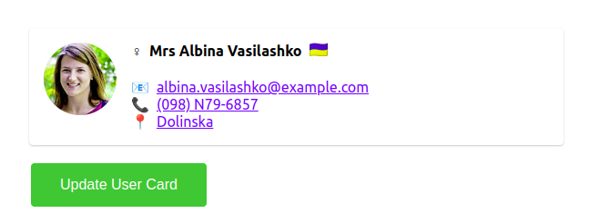

# Conseils

Vous devez refaire le composant UserCard en suivant `maquette.png`. Le CSS est déjà fait, vous pouvez simplement l'importer dans les composants en faisant `import "./monComposant.css`.

Pour vous aider vous pouvez suivre la vidéo "React Props Drilling" ou regarder les fichiers `.bak.jsx` qui contiennent la solution.

Rappel :

Pour démarrer le projet pensez à faire

1. `npm i` => installer les dépendances
1. `npm run start` => démarrer le serveurs
